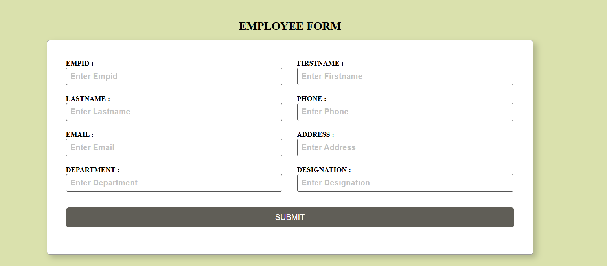
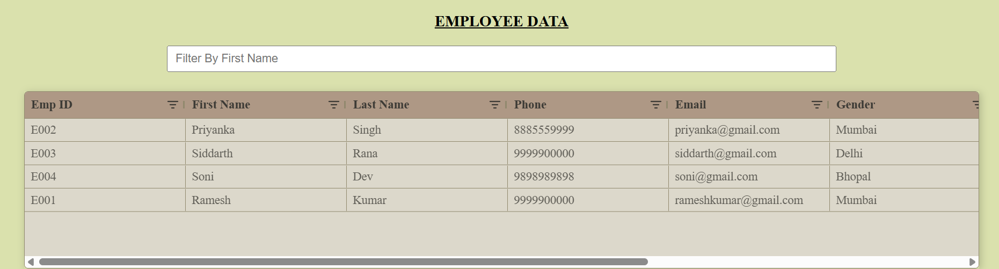

1. Project Name:
   pern_employee_form

2. Short Description:
   Full-stack employee Form using PERN stack and ag-grid-react

3. GitHub Repository URL:
   https://github.com/shainyachary/pern_employee_form

4. Screenshots

   Employee Form

   

   ag-Grid Table View

   

5. Getting Started
   Prerequisites:
   Node.js (v18+)
   PostgreSQL
   npm or yarn

   1. Clone the repository
      git clone https://github.com/shainyachary/pern_employee_form.git
      cd pern_employee_form

   2. Install dependencies

      Backend:
      cd server
      npm install

      Frontend:
      cd client
      npm install

   3. Running the App

      Backend
      cd server
      npm run dev

      Frontend
      cd client
      npm run dev
